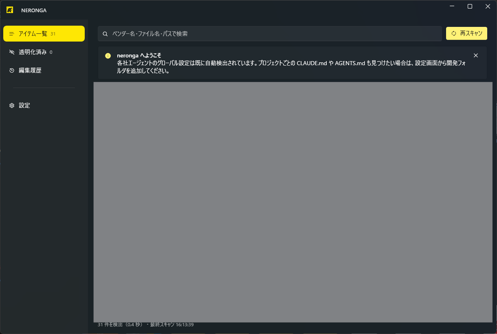
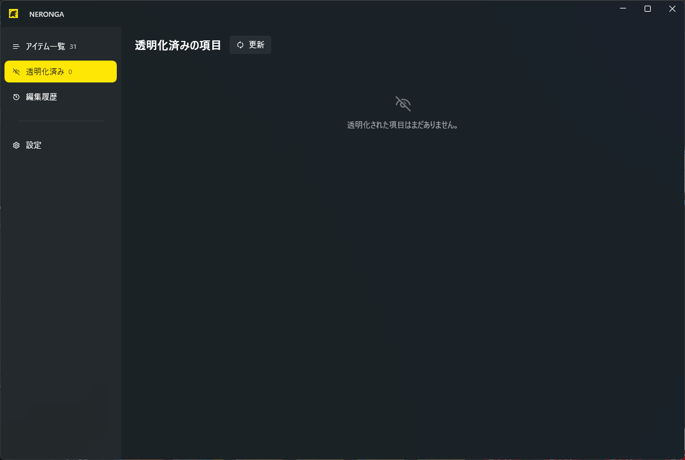
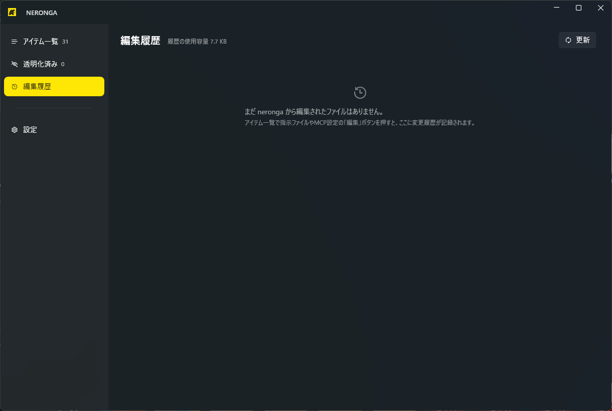
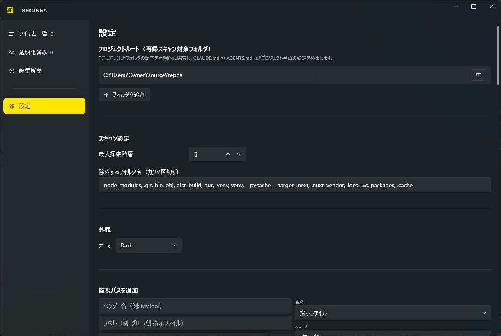

# neronga

**[English README](README.md)**

Claude Code、OpenAI Codex CLI、GitHub Copilot、Google Antigravity / Gemini CLI、Cursor、Windsurf、Cline などの各種 AI コーディングツールが配置する設定ファイルや skills、MCP 設定を検出し、一元的に管理・整理するための Windows デスクトップアプリです。

各ツールは、**skills ディレクトリ**、**カスタム指示ファイル**（`CLAUDE.md`、`AGENTS.md`、`copilot-instructions.md` など）、**MCP サーバー設定** を、ユーザープロファイル配下やプロジェクトリポジトリ内にそれぞれ配置します。ツールを併用していると設定が散在し、現状の把握や管理が煩雑になりがちです。neronga はこれらを一箇所に集約して可視化し、不要な設定の一時的な「透明化」（退避）や、ローカル完結の変更履歴（Git）を備えた設定ファイルの内蔵エディタ編集機能を提供します。

## 画面

| | |
| --- | --- |
| **アイテム一覧** — 検出した skills フォルダ・指示ファイル・MCP 設定をベンダーごとに一覧表示します。各行からエクスプローラーで開く／パスをコピー／編集／透明化が行えます。 |  |
| **透明化済み** — 退避中の項目の一覧です。いつでも元の場所へ復元できます。 |  |
| **編集履歴** — neronga 経由で編集したファイルと、その編集回数・履歴リポジトリの使用容量を表示します。 |  |
| **設定** — プロジェクトルート、探索階層と除外フォルダ、テーマ、UI 言語、監視対象パスのカタログを管理します。 |  |

## 主な機能

- **主要ツールのプリセットを標準搭載。** Claude Code、OpenAI Codex CLI、GitHub Copilot、Google Antigravity をはじめ、Cursor、Windsurf、Cline、Roo Code、Continue.dev、Amazon Q Developer CLI、JetBrains AI Assistant (Junie)、および共通規格である `AGENTS.md` / `.agents/skills` の既定パスカタログを内蔵。設定パスは自由に追加・編集・無効化・削除が可能です。
- **グローバルおよびプロジェクト単位のスキャン。** ユーザープロファイル配下のグローバル設定は起動時に自動検出します。設定画面でプロジェクトルートフォルダを登録すれば、配下のリポジトリに含まれる `CLAUDE.md` や `.mcp.json`、`.github/copilot-instructions.md` などのプロジェクト固有設定も再帰的に検出・一覧化します。
- **「透明化」（安全な一時退避）。** 一時的に無効化したい skill フォルダや指示ファイルを選択して「透明化」を実行すると、ファイルを削除することなく `%LocalAppData%\neronga\vault\<uuid>\` へ安全に退避します。「透明化済み」タブからいつでも元の場所へ復元可能です。
- **ローカル完結の変更履歴管理。** 指示ファイルや MCP 設定を内蔵エディタで直接編集・保存できます。保存ごとにアプリ専用のローカル Git リポジトリ（`%LocalAppData%\neronga\history`、[LibGit2Sharp](https://github.com/libgit2/libgit2sharp) を採用）へ自動コミットされるため、外部の git コマンドやリモートサービスを必要とせず、外部へのデータ送信も一切ありません。変更履歴のブラウズ、差分（diff）の色分け表示、過去バージョンへの復元に対応しています。
- **モダンな Fluent Design UI。** [WPF-UI](https://github.com/lepoco/wpfui) を採用。イエロー＆グレー基調のカラーテーマ、Mica エフェクト、ライト／ダークテーマの切り替えに対応しています。
- **日本語／英語の UI 切り替え。** 設定画面から変更でき、再起動なしで即座に反映されます。内蔵パスカタログのラベル表記も切り替わります。

## ダウンロード

[Releases](../../releases) ページから単一実行ファイル（`neronga.exe`）をダウンロードしてください。インストーラーや .NET ランタイムの事前セットアップは不要で、そのまま実行可能です。

## ソースからビルドする

ビルドには [.NET 10 SDK](https://dotnet.microsoft.com/) 以降が必要です（アプリの実行は Windows 専用ですが、ビルド自体は Windows / macOS / Linux いずれの環境でも実行できます）。

```bash
git clone https://github.com/mokouliszt/neronga.git
cd neronga/src/Neronga
dotnet publish -c Release
```

単一実行ファイルが `bin/Release/net10.0-windows/win-x64/publish/neronga.exe` に出力されます。

## データの保存場所

neronga が使用・管理するデータはすべてローカルの `%LocalAppData%\neronga\` 配下に保存されます。

| パス | 内容 |
| --- | --- |
| `config.json` | パスカタログ、プロジェクトルート、各種設定（テーマ、UI 言語） |
| `vault\<uuid>\` | 透明化（退避）ストレージ。退避項目ごとにフォルダが作成され、元の配置場所を記録した `__neronga_meta.json` を保持 |
| `history\` | neronga 経由で編集したファイルの全バージョンを追跡する専用のローカル Git リポジトリ |

すべての操作はローカルで完結し、外部へデータが送信されることはありません。

## 技術スタック

- .NET 10、WPF、[WPF-UI](https://github.com/lepoco/wpfui)（Fluent Design コントロール）
- [LibGit2Sharp](https://github.com/libgit2/libgit2sharp)（ローカル完結の変更履歴管理）
- [CommunityToolkit.Mvvm](https://github.com/CommunityToolkit/dotnet)（MVVM アーキテクチャ基盤）

## 既定パスに関する注意

サードパーティ製ツールの設定ファイル配置は、ツールのアップデートや環境によって異なる場合があります。主要ツール（Claude Code、OpenAI Codex CLI、GitHub Copilot、Google Antigravity など）の既定値は公式ドキュメントに基づいて設定していますが、その他のツールを含め、必要に応じて設定画面からいつでもパスの追加・変更・無効化が可能です。

## ライセンス

[MIT](LICENSE)
